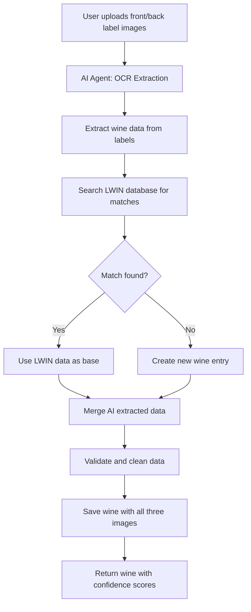

# Wine Image Types - Multi-Image Support

## Overview

Le Grimoire now supports three distinct image types for each wine to enhance AI extraction, catalog display, and label analysis.

## Image Types

### 1. **Front Label Image** (`front_label_image`)
- **Purpose**: Primary label image for OCR and AI data extraction
- **Use Cases**:
  - AI/OCR text extraction (wine name, producer, vintage)
  - Label recognition and matching
  - Visual search in LWIN database
- **Resolution**: High-resolution preferred for accurate OCR
- **Storage**: Backend `/uploads/wines/labels/front/`

### 2. **Back Label Image** (`back_label_image`)
- **Purpose**: Secondary label for additional information extraction
- **Use Cases**:
  - Extract tasting notes from back label
  - Read alcohol content, volume, barcode
  - Extract appellation/designation details
  - Read grape variety composition
- **Resolution**: High-resolution preferred for accurate OCR
- **Storage**: Backend `/uploads/wines/labels/back/`

### 3. **Bottle Image** (`bottle_image`)
- **Purpose**: Full bottle display image for catalog/library
- **Use Cases**:
  - Default display image in wine catalog
  - Gallery view in cellier
  - Marketing/presentation view
  - Mobile app display
- **Resolution**: Medium-resolution optimized for display
- **Storage**: Backend `/uploads/wines/bottles/`

### 4. **Legacy Image** (`image_url`)
- **Purpose**: Backward compatibility
- **Status**: Deprecated - migrating to `bottle_image`
- **Action**: New wines should use `bottle_image` instead

## Database Schema

### MongoDB Wine Model

```python
# Label Images (for AI extraction and detailed view)
front_label_image: Optional[str] = None  # Front label for OCR/AI
back_label_image: Optional[str] = None   # Back label for OCR/AI
bottle_image: Optional[str] = None       # Full bottle for catalog

# Legacy field - deprecated
image_url: Optional[str] = None
```

### API Models

**AdminWineCreate, AdminWineUpdate, AdminWineResponse:**
```python
image_url: Optional[str] = None
front_label_image: Optional[str] = None
back_label_image: Optional[str] = None
bottle_image: Optional[str] = None
```

**LWINDetailResponse:**
```python
image_url: Optional[str] = None
front_label_image: Optional[str] = None
back_label_image: Optional[str] = None
bottle_image: Optional[str] = None
```

### Frontend TypeScript

```typescript
interface Wine {
  image_url?: string;
  front_label_image?: string;
  back_label_image?: string;
  bottle_image?: string;
  // ... other fields
}
```

## Implementation Status

### ✅ Completed
- Database schema updated with three image fields
- API models updated (AdminWineCreate, AdminWineUpdate, AdminWineResponse)
- LWIN API model updated (LWINDetailResponse)
- Frontend TypeScript interfaces updated
- All API endpoints return new image fields

### 🔄 In Progress
- UI for uploading three separate images
- Image upload endpoint modifications
- Display logic for different image types
- Migration script for existing wines

### 📋 TODO
- AI agent integration for label extraction
- LWIN database search/matching to avoid duplicates
- OCR service integration for front/back labels
- Image quality validation
- Automatic image type detection
- Bulk import with multiple images

## AI Agent Workflow

### Wine Creation with AI Agent



### Label Extraction Process

1. **Front Label Processing**:
   - Extract wine name
   - Identify producer/château
   - Read vintage year
   - Detect wine type (color)
   - Read classification (AOP, Grand Cru, etc.)

2. **Back Label Processing**:
   - Extract alcohol content
   - Read grape variety composition
   - Extract tasting notes
   - Read volume/bottle size
   - Extract barcode

3. **LWIN Database Matching**:
   - Search by producer + wine name
   - Match by region + appellation
   - Compare vintage + LWIN codes
   - Calculate confidence score
   - Avoid duplicate entries

4. **Data Validation**:
   - Verify extracted vs LWIN data
   - Flag discrepancies for admin review
   - Suggest corrections
   - Update confidence metrics

## Upload API Endpoints

### New Multi-Image Upload
```bash
POST /api/v2/admin/wines/{wine_id}/images
Content-Type: multipart/form-data

{
  "front_label": <file>,
  "back_label": <file>,
  "bottle": <file>,
  "image_type": "all" | "labels" | "bottle"
}
```

### Individual Image Upload
```bash
POST /api/v2/admin/wines/{wine_id}/images/{image_type}
Content-Type: multipart/form-data

image_type: "front_label" | "back_label" | "bottle"
```

## UI Components Needed

### 1. **Multi-Image Upload Widget**
```tsx
<WineImageUpload
  wineId={wine.id}
  onUploadComplete={(images) => {
    setWine({
      ...wine,
      front_label_image: images.front,
      back_label_image: images.back,
      bottle_image: images.bottle
    });
  }}
/>
```

### 2. **Image Gallery Viewer**
```tsx
<WineImageGallery
  images={{
    front: wine.front_label_image,
    back: wine.back_label_image,
    bottle: wine.bottle_image
  }}
  onImageSelect={(type, url) => {
    // Display full-size image
  }}
/>
```

### 3. **Image Type Indicator**
- Show which images are available
- Display image quality/resolution
- Indicate source (AI extracted, manual upload, etc.)

## Storage Strategy

### Directory Structure
```
/uploads/wines/
  ├── labels/
  │   ├── front/
  │   │   └── {wine_id}_{timestamp}.jpg
  │   └── back/
  │       └── {wine_id}_{timestamp}.jpg
  └── bottles/
      └── {wine_id}_{timestamp}.jpg
```

### Naming Convention
- Format: `{wine_id}_{image_type}_{timestamp}.{ext}`
- Example: `6903de8b_front_label_20251030.jpg`

### Image Optimization
- Front/back labels: High-res PNG/JPG (OCR quality)
- Bottle images: Optimized JPG (display quality)
- Automatic resizing/compression
- Generate thumbnails for gallery views

## Migration Plan

### Phase 1: Schema Update ✅
- Add three new fields to Wine model
- Update all API models
- Update frontend interfaces

### Phase 2: Upload Infrastructure
- Create multi-image upload endpoint
- Implement image storage service
- Add image validation/optimization

### Phase 3: UI Implementation
- Build multi-image upload component
- Create image gallery viewer
- Update admin wine edit page
- Add image management UI

### Phase 4: AI Integration
- Integrate OCR service (Tesseract, Google Vision API)
- Implement label extraction logic
- Add LWIN database search
- Build duplicate detection

### Phase 5: Data Migration
- Migrate existing `image_url` to `bottle_image`
- Backfill missing image types
- Clean up legacy data

## Best Practices

1. **Always upload both labels** when creating wines via AI
2. **Use bottle image** as the default catalog display
3. **Store original images** before optimization
4. **Tag image source** (manual, AI, API)
5. **Validate image quality** before OCR processing
6. **Cache extracted data** to avoid re-processing
7. **Search LWIN first** before creating new wines
8. **Flag low-confidence matches** for admin review

## Security Considerations

- Validate file types (JPG, PNG only)
- Limit file sizes (front/back: 5MB, bottle: 2MB)
- Scan for malware
- Generate unique filenames
- Store outside web root
- Use signed URLs for access
- Implement rate limiting on uploads

## Performance Optimization

- Lazy load images in gallery
- Generate thumbnails on upload
- Use CDN for image delivery
- Implement image caching
- Progressive image loading
- Compress images without quality loss

## Monitoring & Analytics

Track:
- Upload success/failure rates
- OCR accuracy per image type
- LWIN match confidence scores
- AI extraction performance
- Duplicate detection effectiveness
- Image storage usage

## Next Steps

1. Implement multi-image upload endpoint
2. Build OCR service integration
3. Create LWIN search/matching logic
4. Build admin UI for image management
5. Test AI agent workflow end-to-end
6. Deploy and monitor

---

**Status**: Phase 1 Complete - Schema and API models updated
**Last Updated**: October 30, 2025
**Next Milestone**: Image upload infrastructure (Phase 2)
